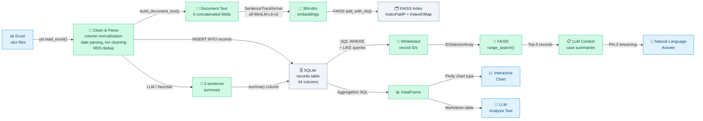
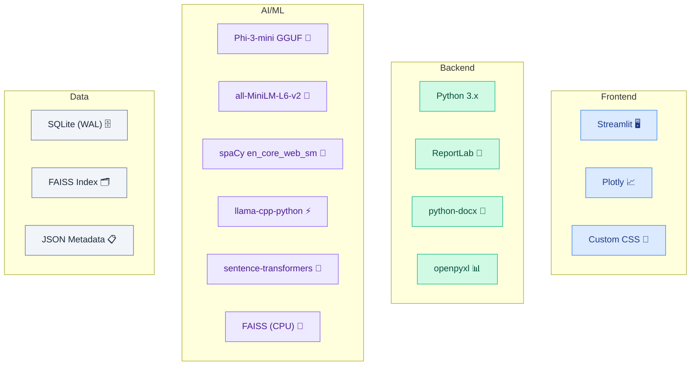

# 🏗️ Automotive QA Intelligence — Complete System Architecture Flow Graph

> **Generated from**: Full source-code analysis of 17 source modules across 9 packages  
> **Project**: Offline Automotive QA Intelligence Engine with RAG, NLP, and LLM  
> **Stack**: Streamlit · SQLite · FAISS · Phi-3 GGUF · spaCy · SentenceTransformers · Plotly · ReportLab

---

## 1. End-to-End System Flow Diagram (Mermaid)

> [!IMPORTANT]
> This is a **single continuous graph** connecting every module, function, and data flow in the project — from user input to final rendered output. Color-coded by architectural layer.

```mermaid
flowchart TB
    %% ─── STYLES ───
    classDef user fill:#dbeafe,stroke:#3b82f6,stroke-width:2px,color:#1e3a8a
    classDef ui fill:#e0f2fe,stroke:#0ea5e9,stroke-width:1.5px,color:#0c4a6e
    classDef auth fill:#fce7f3,stroke:#ec4899,stroke-width:1.5px,color:#831843
    classDef core fill:#fef3c7,stroke:#f59e0b,stroke-width:1.5px,color:#78350f
    classDef nlp fill:#d1fae5,stroke:#10b981,stroke-width:1.5px,color:#064e3b
    classDef rag fill:#ede9fe,stroke:#8b5cf6,stroke-width:1.5px,color:#4c1d95
    classDef llm fill:#fee2e2,stroke:#ef4444,stroke-width:1.5px,color:#7f1d1d
    classDef analytics fill:#ccfbf1,stroke:#14b8a6,stroke-width:1.5px,color:#134e4a
    classDef db fill:#f1f5f9,stroke:#64748b,stroke-width:2px,color:#1e293b
    classDef cache fill:#fff7ed,stroke:#f97316,stroke-width:1.5px,color:#7c2d12
    classDef viz fill:#fdf4ff,stroke:#a855f7,stroke-width:1.5px,color:#581c87
    classDef report fill:#f0fdf4,stroke:#22c55e,stroke-width:1.5px,color:#14532d
    classDef etl fill:#fefce8,stroke:#eab308,stroke-width:1.5px,color:#713f12
    classDef output fill:#f0f9ff,stroke:#0284c7,stroke-width:2px,color:#0c4a6e

    %% ═══════════════════════════════════════════
    %% LAYER 1: USER INTERACTION
    %% ═══════════════════════════════════════════
    USER["👤 User / Technician"]:::user

    subgraph FRONTEND["🖥️ Frontend — app/main.py"]
        direction TB
        LOGIN["show_login_screen()
        Text input: username
        Button: Enter Workspace"]:::ui
        
        SIDEBAR["show_sidebar()
        ├─ Navigation Panel
        ├─ Chat Sessions List
        └─ Logout"]:::ui
        
        CHAT_PAGE["render_chat_page()
        ├─ Welcome Screen + Starters
        ├─ Chat History Renderer
        ├─ st.chat_input()
        └─ Response Renderer"]:::ui
        
        DASHBOARD["render_dashboard_page()
        ├─ 4× Metric Cards
        ├─ Trouble Codes Bar Chart
        ├─ Quality Donut Chart
        ├─ Monthly Trend Line
        └─ Model Comparison Table"]:::ui
        
        REPORTS_PAGE["render_reports_page()
        ├─ Year/Month Selectors
        ├─ Generate Button
        └─ PDF/DOCX Download"]:::ui
        
        CHART_RENDERER["render_plotly_chart()
        Routes to 6 chart types"]:::ui
        
        CITATION_RENDERER["render_citations()
        FTIR source cards"]:::ui
        
        HISTORY_LOADER["pre_populate_history_metadata()
        Re-hydrates visual metadata
        from cache on session load"]:::ui
    end

    %% ═══════════════════════════════════════════
    %% LAYER 2: AUTHENTICATION
    %% ═══════════════════════════════════════════
    subgraph AUTH_LAYER["🔐 Authentication — auth/session.py"]
        direction TB
        VERIFY["verify_or_create_user()
        Lookup or INSERT into users table"]:::auth
        MIGRATE["migrate_db_for_sessions()
        Create chat_sessions table
        Add session_id to chat_history"]:::auth
        CREATE_SESSION["create_chat_session()"]:::auth
        GET_SESSIONS["get_user_chat_sessions()"]:::auth
        GET_HISTORY["get_session_chat_history()"]:::auth
        ADD_MSG["add_chat_message()"]:::auth
        UPDATE_TITLE["update_chat_session_title()"]:::auth
        DELETE_SESSION["delete_chat_session()"]:::auth
    end

    %% ═══════════════════════════════════════════
    %% LAYER 3: CORE ORCHESTRATION
    %% ═══════════════════════════════════════════
    subgraph CORE_LAYER["⚙️ Core Orchestration"]
        direction TB
        
        subgraph ROUTER["core/router.py — QueryRouter"]
            DISPATCH["dispatch_query()
            Main entry point
            ├─ 1. Check cache
            ├─ 2. Parse NLP
            ├─ 3. Route by intent
            └─ Return result dict"]:::core
            
            HANDLE_SEARCH["_handle_search()
            ├─ Build SQL WHERE
            ├─ Keyword LIKE search
            ├─ FAISS vector search
            ├─ Combine + rank results
            ├─ Fetch top-5 records
            ├─ Build LLM prompt
            └─ Return messages + citations"]:::core
            
            HANDLE_ANALYTICS["_handle_analytics()
            ├─ Try LLM SQL generation
            ├─ Fallback: static routing
            ├─ Select chart type
            ├─ Build markdown table
            ├─ Build LLM narration prompt
            └─ Return df + messages + chart"]:::core
        end
        
        subgraph SINGLETONS["core/singletons.py"]
            GET_DB["get_db_connection()
            @st.cache_resource
            Returns db_path string
            Sets WAL + NORMAL mode"]:::core
            GET_EMBEDDER["get_embedder()
            @st.cache_resource
            Loads SentenceTransformer
            + FAISS index"]:::core
            GET_LLM["get_llm()
            @st.cache_resource
            Loads Phi-3 GGUF model
            GPU offload: n_gpu_layers=-1"]:::core
            TRACKER["IngestionTracker
            Thread-safe tracking
            of background ingests"]:::core
        end
        
        subgraph PATHS["core/paths.py"]
            PATH_FUNCS["get_project_root()
            get_db_path()
            get_index_path()
            get_metadata_path()
            get_inbox_path()
            get_model_path()"]:::core
        end
    end

    %% ═══════════════════════════════════════════
    %% LAYER 4: CACHING
    %% ═══════════════════════════════════════════
    subgraph CACHE_LAYER["💾 Caching — core/cache.py"]
        direction TB
        QUERY_CACHE["QueryCache
        ├─ L1: RAM dict (max 200)
        ├─ L2: SQLite query_cache table
        ├─ TTL: 7200s (2 hours)
        ├─ Key: MD5(query_text)
        └─ Auto-prune expired"]:::cache
        
        EMB_CACHE["EmbeddingCache
        ├─ SQLite embedding_cache table
        ├─ Key: MD5(text)
        └─ Value: numpy blob"]:::cache
    end

    %% ═══════════════════════════════════════════
    %% LAYER 5: NLP PIPELINE
    %% ═══════════════════════════════════════════
    subgraph NLP_LAYER["🧠 NLP Pipeline — nlp/pipeline.py — NLPProcessor"]
        direction TB
        PARSE_QUERY["parse_query()
        Main NLP entry point
        ├─ 1. load_spacy()
        ├─ 2. classify_intent()
        ├─ 3. extract_entities_regex()
        ├─ 4. spaCy NER overlay
        └─ 5. extract_filters()"]:::nlp
        
        CLASSIFY["classify_intent()
        Score-based keyword matching
        → SEARCH | ANALYTICS
        → VISUALIZE | VISUALIZE+EXPLAIN
        → COMPARE | REPORT
        → AMBIGUOUS (score=0)"]:::nlp
        
        ENTITIES["extract_entities_regex()
        Regex + DB-loaded patterns
        → TROUBLE_CODE: P/B/C/U + 4 digits
        → PRODUCT_MODEL: Y + 5-9 alphanum
        → SALES_MODEL: 3 letters + 3-4 digits
        → COUNTRY: from DB lookup
        → VIN: MA3 + 14 chars
        → FTIR_NO: FTIR/YYYY/NNNN"]:::nlp
        
        FILTERS["extract_filters()
        → year (2020-2030)
        → month name mapping
        → top N / limit
        → km_max / km_min
        → quality rating
        → segmentation"]:::nlp
        
        KEYWORDS["extract_keywords()
        spaCy POS: NOUN/PROPN/ADJ
        Fallback: regex tokenizer
        Stop-word filtering"]:::nlp
        
        SPACY_LOAD["load_spacy()
        en_core_web_sm model
        + EntityRuler patterns
        Graceful fallback to regex"]:::nlp
    end

    %% ═══════════════════════════════════════════
    %% LAYER 6: RAG / VECTOR SEARCH
    %% ═══════════════════════════════════════════
    subgraph RAG_LAYER["🔮 RAG Pipeline"]
        direction TB
        
        subgraph EMBEDDER["rag/embedder.py — VectorEmbedder"]
            ENCODE["encode()
            ├─ Check EmbeddingCache
            ├─ SentenceTransformer.encode()
            ├─ faiss.normalize_L2()
            └─ Save to EmbeddingCache"]:::rag
            
            SEARCH_SUBSET["search_subset()
            ├─ encode query
            ├─ IDSelectorArray whitelist
            ├─ FAISS range_search()
            ├─ Filter by threshold
            └─ Sort by score DESC"]:::rag
            
            BUILD_INDEX["build_index()
            ├─ encode all texts
            ├─ IndexFlatIP + IndexIDMap
            ├─ add_with_ids()
            └─ save_index()"]:::rag
            
            APPEND_INDEX["append_to_index()
            ├─ encode new texts
            ├─ add_with_ids()
            └─ save_index()"]:::rag
            
            REBUILD["rebuild_index_from_db()
            Full re-index from SQLite"]:::rag
            
            LOAD_INDEX["load_index()
            faiss.read_index()
            + JSON metadata"]:::rag
        end
        
        subgraph DOC_BUILDER["rag/document_builder.py"]
            BUILD_DOC["build_document_text()
            Concatenates:
            Subject + Complaint +
            Checked Contents/Results +
            Repair + Causal Part
            → single embedding text"]:::rag
        end
    end

    %% ═══════════════════════════════════════════
    %% LAYER 7: LLM INFERENCE
    %% ═══════════════════════════════════════════
    subgraph LLM_LAYER["🤖 LLM Inference — llm/client.py — LocalLLMClient"]
        direction TB
        LOAD_MODEL["load_model()
        llama_cpp.Llama()
        ├─ n_ctx=14096
        ├─ n_gpu_layers=-1
        ├─ use_mlock=True
        └─ Phi-3 / Qwen2.5 GGUF"]:::llm
        
        GEN_SUMMARY["generate_summary()
        Synchronous completion
        max_tokens=150, temp=0.1
        Used in ETL ingestion"]:::llm
        
        GEN_STREAM["generate_chat_stream()
        Streaming completion
        Phi-3 chat template
        max_tokens=300, temp=0.1
        Yields token chunks"]:::llm
    end

    %% ═══════════════════════════════════════════
    %% LAYER 8: ANALYTICS ENGINE
    %% ═══════════════════════════════════════════
    subgraph ANALYTICS_LAYER["📊 Analytics Engine"]
        direction TB
        
        subgraph ENGINE["analytics/engine.py — AnalyticsEngine"]
            LLM_SQL["query_via_llm()
            ├─ Format Phi-3 prompt
            ├─ Few-shot SQL examples
            ├─ Parse + clean SQL
            ├─ Execute on SQLite
            └─ Retry loop (max 4)"]:::analytics
            
            STATIC_QUERIES["Static Query Methods:
            ├─ get_top_dealers_or_countries()
            ├─ get_trouble_code_frequency()
            ├─ get_monthly_failure_trend()
            ├─ get_model_comparison()
            ├─ get_using_km_distribution()
            ├─ get_quality_distribution()
            ├─ get_repair_success_rate()
            ├─ get_failed_parts_frequency()
            └─ get_overall_resolution_stats()"]:::analytics
        end
        
        subgraph GRAPH_SEL["analytics/graph_selector.py"]
            SELECT_CHART["select_chart_type()
            ├─ Check user-requested type
            ├─ Infer from columns + intent
            ├─ Types: horizontal_bar, line
            │   donut, histogram, radar
            │   grouped_bar, empty
            └─ Returns (type, title)"]:::analytics
        end
        
        subgraph VIEWS["analytics/views.py"]
            REFRESH_MV["refresh_materialized_views()
            ├─ mv_country_month
            ├─ mv_trouble_codes
            ├─ mv_dealer_summary
            └─ mv_quality_dist"]:::analytics
        end
    end

    %% ═══════════════════════════════════════════
    %% LAYER 9: VISUALIZATION
    %% ═══════════════════════════════════════════
    subgraph VIZ_LAYER["📈 Visualization — viz/charts.py"]
        direction TB
        PLOT_HBAR["plot_horizontal_bar()"]:::viz
        PLOT_LINE["plot_line_trend()"]:::viz
        PLOT_DONUT["plot_donut_chart()"]:::viz
        PLOT_HIST["plot_histogram()"]:::viz
        PLOT_RADAR["plot_radar_comparison()"]:::viz
        PLOT_GBAR["plot_grouped_bar()"]:::viz
        PREMIUM_LAYOUT["apply_premium_layout()
        Theme colors, fonts, grids"]:::viz
    end

    %% ═══════════════════════════════════════════
    %% LAYER 10: ETL / DATA INGESTION
    %% ═══════════════════════════════════════════
    subgraph ETL_LAYER["📥 ETL Pipeline"]
        direction TB
        
        subgraph PIPELINE["etl/pipeline.py"]
            INGEST["ingest_excel()
            ├─ pd.read_excel()
            ├─ Column normalization
            ├─ Row-level dedup (MD5)
            ├─ Field parsing/cleaning
            ├─ LLM or heuristic summary
            ├─ INSERT INTO records
            └─ refresh_materialized_views()"]:::etl
            
            HELPERS["Helper Functions:
            ├─ clean_km()
            ├─ parse_date()
            ├─ extract_year_month()
            ├─ calculate_row_hash()
            └─ generate_heuristic_summary()"]:::etl
        end
    end

    %% ═══════════════════════════════════════════
    %% LAYER 11: REPORT GENERATION
    %% ═══════════════════════════════════════════
    subgraph REPORT_LAYER["📄 Reports — reports/engine.py — ReportEngine"]
        direction TB
        GET_DATA["_get_report_data()
        ├─ Total claims count
        ├─ Claims by country
        ├─ Claims by model
        ├─ Top trouble codes
        └─ Top 5 sample cases"]:::report
        
        GEN_PDF["generate_pdf_report()
        ReportLab + NumberedCanvas
        Premium styles + tables"]:::report
        
        GEN_DOCX["generate_docx_report()
        python-docx Document
        Styled tables + headings"]:::report
        
        GEN_CHAT_PDF["generate_chat_pdf()
        Chat transcript export
        ├─ User/assistant bubbles
        ├─ SQL query blocks
        ├─ DataFrame tables
        ├─ Embedded chart images
        └─ Citation references"]:::report
        
        NUMBERED_CANVAS["NumberedCanvas
        Headers + footers
        Page X of N"]:::report
    end

    %% ═══════════════════════════════════════════
    %% LAYER 12: DATABASE
    %% ═══════════════════════════════════════════
    subgraph DB_LAYER["🗄️ Database — SQLite (WAL Mode)"]
        direction TB
        RECORDS_TBL["records table
        44 columns · 9 indexes
        FTIR quality case data"]:::db
        USERS_TBL["users table
        id, username, created_at"]:::db
        CHAT_HIST_TBL["chat_history table
        user_id, session_id, role, content"]:::db
        CHAT_SESS_TBL["chat_sessions table
        user_id, title, created_at"]:::db
        QUERY_CACHE_TBL["query_cache table
        query_hash, result_json, expires_at"]:::db
        EMB_CACHE_TBL["embedding_cache table
        text_hash, embedding_blob"]:::db
        MV_TABLES["Materialized Views:
        mv_country_month
        mv_trouble_codes
        mv_dealer_summary
        mv_quality_dist"]:::db
    end

    %% ═══════════════════════════════════════════
    %% LAYER 13: VECTOR STORE
    %% ═══════════════════════════════════════════
    subgraph VECTOR_STORE["🧲 FAISS Vector Store"]
        FAISS_INDEX["faiss_index.bin
        IndexFlatIP + IndexIDMap
        384-dim cosine similarity"]:::rag
        VECTOR_META["vector_metadata.json
        Parallel metadata list
        id, country, model, etc."]:::rag
    end

    %% ═══════════════════════════════════════════
    %% LAYER 14: ML MODELS (ON DISK)
    %% ═══════════════════════════════════════════
    subgraph MODELS_LAYER["🧬 ML Models"]
        PHI3["Phi-3-mini-4k-instruct-q4.gguf
        2.4 GB · Quantized · GPU"]:::llm
        QWEN["Qwen2.5-7B-Instruct-Q4_K_M.gguf
        4.7 GB · Quantized · GPU"]:::llm
        MINILM["all-MiniLM-L6-v2
        SentenceTransformer
        384-dim embeddings"]:::rag
        SPACY_MODEL["en_core_web_sm
        spaCy NER + POS"]:::nlp
    end

    %% ═══════════════════════════════════════════
    %% LAYER 15: FINAL OUTPUT
    %% ═══════════════════════════════════════════
    OUTPUT["📤 Final Output
    ├─ Streamed LLM text
    ├─ DataFrames + tables
    ├─ Plotly interactive charts
    ├─ Citation cards
    ├─ PDF / DOCX downloads
    └─ Dashboard metrics"]:::output

    %% ═══════════════════════════════════════════════
    %% CONNECTIONS — USER INTERACTION FLOW
    %% ═══════════════════════════════════════════════

    USER -->|"Username input"| LOGIN
    LOGIN -->|"verify_or_create_user()"| VERIFY
    VERIFY -->|"migrate_db_for_sessions()"| MIGRATE
    VERIFY -->|"SELECT/INSERT"| USERS_TBL
    MIGRATE -->|"CREATE TABLE"| CHAT_SESS_TBL
    LOGIN -->|"create_chat_session()"| CREATE_SESSION
    CREATE_SESSION -->|"INSERT"| CHAT_SESS_TBL
    LOGIN -->|"get_session_chat_history()"| GET_HISTORY
    GET_HISTORY -->|"SELECT"| CHAT_HIST_TBL

    LOGIN -->|"st.session_state"| SIDEBAR
    SIDEBAR -->|"Navigation click"| CHAT_PAGE
    SIDEBAR -->|"Navigation click"| DASHBOARD
    SIDEBAR -->|"Navigation click"| REPORTS_PAGE
    SIDEBAR -->|"New Chat"| CREATE_SESSION
    SIDEBAR -->|"Switch session"| GET_HISTORY
    SIDEBAR -->|"Delete session"| DELETE_SESSION
    DELETE_SESSION -->|"DELETE"| CHAT_HIST_TBL
    DELETE_SESSION -->|"DELETE"| CHAT_SESS_TBL

    %% ═══════════════════════════════════════════════
    %% CONNECTIONS — CHAT QUERY FLOW (MAIN PIPELINE)
    %% ═══════════════════════════════════════════════

    CHAT_PAGE -->|"st.chat_input() / starter click"| DISPATCH
    CHAT_PAGE -->|"add_chat_message()"| ADD_MSG
    ADD_MSG -->|"INSERT"| CHAT_HIST_TBL
    CHAT_PAGE -->|"update_chat_session_title()"| UPDATE_TITLE
    UPDATE_TITLE -->|"UPDATE"| CHAT_SESS_TBL

    %% Router dispatch flow
    DISPATCH -->|"1. cache.get()"| QUERY_CACHE
    QUERY_CACHE -->|"L1 check"| QUERY_CACHE
    QUERY_CACHE -->|"L2 check"| QUERY_CACHE_TBL
    
    DISPATCH -->|"2. nlp.parse_query()"| PARSE_QUERY
    PARSE_QUERY --> CLASSIFY
    PARSE_QUERY --> ENTITIES
    PARSE_QUERY --> FILTERS
    PARSE_QUERY --> KEYWORDS
    CLASSIFY -->|"returns intent"| DISPATCH

    DISPATCH -->|"SEARCH / AMBIGUOUS"| HANDLE_SEARCH
    DISPATCH -->|"ANALYTICS / VISUALIZE / COMPARE"| HANDLE_ANALYTICS
    DISPATCH -->|"REPORT"| CHAT_PAGE

    %% Search flow
    HANDLE_SEARCH -->|"SQL WHERE builder"| RECORDS_TBL
    HANDLE_SEARCH -->|"Keyword LIKE query"| RECORDS_TBL
    HANDLE_SEARCH -->|"search_subset()"| SEARCH_SUBSET
    SEARCH_SUBSET -->|"encode()"| ENCODE
    ENCODE -->|"cache check"| EMB_CACHE
    EMB_CACHE -->|"get/set"| EMB_CACHE_TBL
    ENCODE -->|"model.encode()"| MINILM
    SEARCH_SUBSET -->|"range_search()"| FAISS_INDEX
    HANDLE_SEARCH -->|"Fetch top-5 records"| RECORDS_TBL
    HANDLE_SEARCH -->|"Build prompt + citations"| CHAT_PAGE

    %% Analytics flow
    HANDLE_ANALYTICS -->|"Try query_via_llm()"| LLM_SQL
    LLM_SQL -->|"get_llm()"| GET_LLM
    GET_LLM -->|"load_model()"| LOAD_MODEL
    LOAD_MODEL -->|"load GGUF"| PHI3
    LLM_SQL -->|"Execute generated SQL"| RECORDS_TBL
    HANDLE_ANALYTICS -->|"Fallback: static methods"| STATIC_QUERIES
    STATIC_QUERIES -->|"SQL queries"| RECORDS_TBL
    HANDLE_ANALYTICS -->|"select_chart_type()"| SELECT_CHART

    %% LLM streaming in UI
    CHAT_PAGE -->|"text_stream → generate_chat_stream()"| GEN_STREAM
    GEN_STREAM -->|"Phi-3 template"| PHI3
    CHAT_PAGE -->|"table_stream → generate_chat_stream()"| GEN_STREAM

    %% Chart rendering
    CHAT_PAGE -->|"render_plotly_chart()"| CHART_RENDERER
    CHART_RENDERER --> PLOT_HBAR
    CHART_RENDERER --> PLOT_LINE
    CHART_RENDERER --> PLOT_DONUT
    CHART_RENDERER --> PLOT_HIST
    CHART_RENDERER --> PLOT_RADAR
    CHART_RENDERER --> PLOT_GBAR
    PLOT_HBAR --> PREMIUM_LAYOUT
    PLOT_LINE --> PREMIUM_LAYOUT
    PLOT_DONUT --> PREMIUM_LAYOUT
    PLOT_HIST --> PREMIUM_LAYOUT
    PLOT_RADAR --> PREMIUM_LAYOUT
    PLOT_GBAR --> PREMIUM_LAYOUT

    %% Citation rendering
    CHAT_PAGE -->|"render_citations()"| CITATION_RENDERER

    %% Cache write-back
    CHAT_PAGE -->|"cache.set()"| QUERY_CACHE
    QUERY_CACHE -->|"L2 write"| QUERY_CACHE_TBL

    %% History re-hydration
    CHAT_PAGE -->|"pre_populate_history_metadata()"| HISTORY_LOADER
    HISTORY_LOADER -->|"dispatch_query()"| DISPATCH

    %% ═══════════════════════════════════════════════
    %% CONNECTIONS — DASHBOARD PAGE
    %% ═══════════════════════════════════════════════

    DASHBOARD -->|"Direct SQL counts"| RECORDS_TBL
    DASHBOARD -->|"get_trouble_code_frequency()"| STATIC_QUERIES
    DASHBOARD -->|"get_quality_distribution()"| STATIC_QUERIES
    DASHBOARD -->|"get_monthly_failure_trend()"| STATIC_QUERIES
    DASHBOARD -->|"get_model_comparison()"| STATIC_QUERIES
    DASHBOARD -->|"plot_*()"| VIZ_LAYER

    %% ═══════════════════════════════════════════════
    %% CONNECTIONS — REPORT GENERATION
    %% ═══════════════════════════════════════════════

    REPORTS_PAGE -->|"Generate button"| GEN_PDF
    REPORTS_PAGE -->|"Generate button"| GEN_DOCX
    CHAT_PAGE -->|"Report intent"| GEN_PDF
    CHAT_PAGE -->|"Report intent"| GEN_DOCX
    CHAT_PAGE -->|"Export Chat PDF"| GEN_CHAT_PDF
    GEN_PDF -->|"_get_report_data()"| GET_DATA
    GEN_DOCX -->|"_get_report_data()"| GET_DATA
    GET_DATA -->|"SQL aggregations"| RECORDS_TBL
    GEN_CHAT_PDF -->|"plot_*()"| VIZ_LAYER

    %% ═══════════════════════════════════════════════
    %% CONNECTIONS — ETL INGESTION
    %% ═══════════════════════════════════════════════

    SIDEBAR -->|"Upload .xlsx"| SCAN_INBOX
    SIDEBAR -->|"Reload Dataset btn"| SCAN_INBOX
    SCAN_INBOX -->|"ingest_excel()"| INGEST
    INGEST -->|"pd.read_excel()"| HELPERS
    INGEST -->|"generate_summary()"| GEN_SUMMARY
    GEN_SUMMARY -->|"Phi-3 completion"| PHI3
    INGEST -->|"generate_heuristic_summary()"| HELPERS
    INGEST -->|"INSERT INTO records"| RECORDS_TBL
    INGEST -->|"refresh_materialized_views()"| REFRESH_MV
    REFRESH_MV -->|"DELETE + INSERT"| MV_TABLES
    SCAN_INBOX -->|"build_document_text()"| BUILD_DOC
    SCAN_INBOX -->|"append_to_index()"| APPEND_INDEX
    APPEND_INDEX -->|"encode()"| ENCODE
    APPEND_INDEX -->|"add_with_ids()"| FAISS_INDEX

    %% ═══════════════════════════════════════════════
    %% CONNECTIONS — SINGLETONS INITIALIZATION
    %% ═══════════════════════════════════════════════

    GET_DB -->|"PRAGMA WAL"| RECORDS_TBL
    GET_EMBEDDER -->|"load_model()"| MINILM
    GET_EMBEDDER -->|"load_index()"| LOAD_INDEX
    LOAD_INDEX -->|"read_index()"| FAISS_INDEX
    LOAD_INDEX -->|"read metadata"| VECTOR_META

    %% ═══════════════════════════════════════════════
    %% CONNECTIONS — FINAL OUTPUT
    %% ═══════════════════════════════════════════════

    CHAT_PAGE --> OUTPUT
    DASHBOARD --> OUTPUT
    REPORTS_PAGE --> OUTPUT
    CITATION_RENDERER --> OUTPUT
    CHART_RENDERER --> OUTPUT
```

---

## 2. Detailed Execution Flow Narratives

### 2.1 🔍 SEARCH Intent — Hybrid Retrieval-Augmented Generation

```
User Query: "Find all FTIR reports about transmission failure in US"
│
├─ 1. app/main.py: render_chat_page()
│   └─ Captures query via st.chat_input()
│
├─ 2. core/router.py: QueryRouter.dispatch_query()
│   ├─ 2a. core/cache.py: QueryCache.get() → check L1 RAM → L2 SQLite
│   │
│   ├─ 2b. nlp/pipeline.py: NLPProcessor.parse_query()
│   │   ├─ classify_intent() → "SEARCH" (score: 3, keyword "find")
│   │   ├─ extract_entities_regex() → COUNTRY: ["US"]
│   │   ├─ extract_filters() → {segmentation: "Transmission"}
│   │   └─ extract_keywords() → ["transmission", "failure"]
│   │
│   └─ 2c. core/router.py: _handle_search()
│       ├─ Build SQL: WHERE LOWER(outbreak_country) = LOWER('US')
│       │             AND LOWER(segmentation) = LOWER('Transmission')
│       ├─ Execute SQL pre-filter → metadata_whitelisted_ids
│       ├─ Keyword LIKE search on subject, complaint, parts → sql_matched_ids
│       ├─ rag/embedder.py: search_subset(query, whitelisted_ids, threshold=0.30)
│       │   ├─ encode([query]) → SentenceTransformer → 384-dim vector
│       │   ├─ IDSelectorArray(whitelisted_ids)
│       │   └─ FAISS range_search() → scored results
│       ├─ Combine SQL + FAISS results, sort by score DESC
│       ├─ Fetch top-5 records from SQLite (subject, summary, ftir_no, etc.)
│       ├─ Build system_prompt + user_prompt with context
│       └─ Return {type: "text_stream", data: messages, citations: [...]}
│
├─ 3. app/main.py: render_chat_page() continued
│   ├─ llm/client.py: generate_chat_stream(messages)
│   │   └─ Phi-3 GGUF → streaming tokens → st.write_stream()
│   ├─ render_citations() → FTIR source cards
│   ├─ add_chat_message() → save to chat_history table
│   └─ cache.set() → write result to L1 + L2 cache
│
└─ 4. OUTPUT: Streamed answer + citation cards
```

### 2.2 📊 ANALYTICS / VISUALIZE Intent

```
User Query: "Show me the trend of DTC complaint codes in 2025"
│
├─ 1. NLP: classify_intent() → "ANALYTICS" (keywords: "trend")
│   └─ extract_filters() → {year: 2025}
│
├─ 2. router._handle_analytics()
│   ├─ Try: analytics/engine.py: query_via_llm()
│   │   ├─ Build Phi-3 prompt with schema + few-shot examples
│   │   ├─ LLM generates SQL query
│   │   ├─ Parse: extract SELECT, remove code blocks, truncate at semicolon
│   │   ├─ Execute on SQLite → DataFrame
│   │   └─ Retry loop (max 4 attempts) with error feedback
│   │
│   ├─ Fallback (if LLM SQL fails): Static router
│   │   └─ "trend" in query → get_monthly_failure_trend(year=2025)
│   │
│   ├─ analytics/graph_selector.py: select_chart_type()
│   │   └─ "period" in columns → type="line", title="Monthly Claims Trend"
│   │
│   ├─ Build markdown table for LLM narration (cap at 20 rows)
│   └─ Return {type: "table_stream", data: {df, messages}, chart_type, chart_title}
│
├─ 3. app/main.py:
│   ├─ Show SQL query in expander
│   ├─ st.dataframe(df)
│   ├─ render_plotly_chart("line", df, title)
│   │   └─ viz/charts.py: plot_line_trend() → apply_premium_layout()
│   ├─ LLM narration via generate_chat_stream()
│   └─ Cache result
│
└─ 4. OUTPUT: DataFrame + Line Chart + LLM analysis text
```

### 2.3 📄 REPORT Intent

```
User Query: "Generate monthly report for December 2025"
│
├─ 1. NLP: classify_intent() → "REPORT" (score: 6)
│   └─ extract_filters() → {year: 2025, month: 12}
│
├─ 2. router.dispatch_query() → {type: "report", data: {year, month}}
│
├─ 3. app/main.py:
│   ├─ reports/engine.py: ReportEngine()
│   │   ├─ _get_report_data(2025, 12) → SQL aggregations
│   │   ├─ generate_pdf_report() → ReportLab + NumberedCanvas
│   │   └─ generate_docx_report() → python-docx
│   ├─ st.download_button() for PDF
│   └─ st.download_button() for DOCX
│
└─ 4. OUTPUT: Download buttons for PDF + DOCX reports
```

### 2.4 📥 ETL Ingestion Flow

```
User Action: Upload .xlsx via sidebar
│
├─ 1. app/main.py: show_sidebar() → file_uploader → save to data/inbox/
│
├─ 2. "Reload Dataset" button → etl/manual_ingest.py: scan_and_ingest_inbox()
│   ├─ glob("inbox/*.xlsx") → for each file:
│   │
│   ├─ 3. etl/pipeline.py: ingest_excel()
│   │   ├─ pd.read_excel(sheet_name=0)
│   │   ├─ Column name normalization
│   │   ├─ For each row:
│   │   │   ├─ calculate_row_hash() → MD5 dedup check
│   │   │   ├─ parse_date(), clean_km()
│   │   │   ├─ generate_summary() via LLM or heuristic fallback
│   │   │   └─ INSERT INTO records
│   │   └─ analytics/views.py: refresh_materialized_views()
│   │
│   ├─ 4. rag/document_builder.py: build_document_text() per record
│   │
│   └─ 5. rag/embedder.py: append_to_index()
│       ├─ encode() → SentenceTransformer + EmbeddingCache
│       ├─ FAISS add_with_ids()
│       └─ save_index() → disk
│
└─ 6. OUTPUT: "Processed X files. Ingested Y new records."
```

### 2.5 🔐 Authentication Flow

```
User Action: Enter username
│
├─ auth/session.py: verify_or_create_user()
│   ├─ migrate_db_for_sessions() → ensure chat_sessions table exists
│   ├─ SELECT id FROM users WHERE username = ?
│   ├─ If exists → return user_id
│   └─ If not → INSERT INTO users → return new user_id
│
├─ create_chat_session() or load existing sessions
├─ get_session_chat_history() → populate st.session_state
└─ st.rerun() → render main app
```

---

## 3. Module Dependency Graph (Graphviz DOT)

```dot
digraph AutomotiveQA {
    rankdir=TB;
    compound=true;
    fontname="Inter";
    node [fontname="Inter", fontsize=10, shape=box, style="rounded,filled"];
    edge [fontsize=8, color="#64748b"];

    // UI Layer
    subgraph cluster_ui {
        label="🖥️ UI Layer"; style="filled"; fillcolor="#e0f2fe"; color="#0ea5e9";
        main [label="app/main.py\n(1093 lines)", fillcolor="#bae6fd"];
    }

    // Auth Layer
    subgraph cluster_auth {
        label="🔐 Auth"; style="filled"; fillcolor="#fce7f3"; color="#ec4899";
        session [label="auth/session.py\n(225 lines)", fillcolor="#fbcfe8"];
    }

    // Core Layer
    subgraph cluster_core {
        label="⚙️ Core"; style="filled"; fillcolor="#fef3c7"; color="#f59e0b";
        router [label="core/router.py\nQueryRouter (349 lines)", fillcolor="#fde68a"];
        cache [label="core/cache.py\nQueryCache + EmbeddingCache\n(180 lines)", fillcolor="#fde68a"];
        singletons [label="core/singletons.py\n(103 lines)", fillcolor="#fde68a"];
        paths [label="core/paths.py\n(44 lines)", fillcolor="#fde68a"];
    }

    // NLP Layer
    subgraph cluster_nlp {
        label="🧠 NLP"; style="filled"; fillcolor="#d1fae5"; color="#10b981";
        nlp_pipeline [label="nlp/pipeline.py\nNLPProcessor (306 lines)", fillcolor="#a7f3d0"];
    }

    // RAG Layer
    subgraph cluster_rag {
        label="🔮 RAG"; style="filled"; fillcolor="#ede9fe"; color="#8b5cf6";
        embedder [label="rag/embedder.py\nVectorEmbedder (218 lines)", fillcolor="#ddd6fe"];
        doc_builder [label="rag/document_builder.py\n(38 lines)", fillcolor="#ddd6fe"];
    }

    // LLM Layer
    subgraph cluster_llm {
        label="🤖 LLM"; style="filled"; fillcolor="#fee2e2"; color="#ef4444";
        llm_client [label="llm/client.py\nLocalLLMClient (79 lines)", fillcolor="#fecaca"];
    }

    // Analytics Layer
    subgraph cluster_analytics {
        label="📊 Analytics"; style="filled"; fillcolor="#ccfbf1"; color="#14b8a6";
        analytics_engine [label="analytics/engine.py\nAnalyticsEngine (334 lines)", fillcolor="#99f6e4"];
        graph_selector [label="analytics/graph_selector.py\n(101 lines)", fillcolor="#99f6e4"];
        views [label="analytics/views.py\n(74 lines)", fillcolor="#99f6e4"];
    }

    // Viz Layer
    subgraph cluster_viz {
        label="📈 Viz"; style="filled"; fillcolor="#fdf4ff"; color="#a855f7";
        charts [label="viz/charts.py\n6 chart functions (223 lines)", fillcolor="#f5d0fe"];
    }

    // ETL Layer
    subgraph cluster_etl {
        label="📥 ETL"; style="filled"; fillcolor="#fefce8"; color="#eab308";
        pipeline [label="etl/pipeline.py\ningest_excel() (262 lines)", fillcolor="#fef08a"];
    }

    // Reports Layer
    subgraph cluster_reports {
        label="📄 Reports"; style="filled"; fillcolor="#f0fdf4"; color="#22c55e";
        report_engine [label="reports/engine.py\nReportEngine (657 lines)", fillcolor="#bbf7d0"];
    }

    // Data Stores
    subgraph cluster_data {
        label="🗄️ Data Stores"; style="filled"; fillcolor="#f1f5f9"; color="#64748b";
        sqlite [label="SQLite\nautomotive.db\n(WAL mode)", fillcolor="#e2e8f0"];
        faiss [label="FAISS\nfaiss_index.bin\n+ vector_metadata.json", fillcolor="#e2e8f0"];
        gguf [label="GGUF Models\nPhi-3 / Qwen2.5", fillcolor="#e2e8f0"];
    }

    // Edges - imports and calls
    main -> session [label="auth functions"];
    main -> router [label="QueryRouter"];
    main -> singletons [label="get_db, get_llm"];
    main -> charts [label="plot_*"];
    main -> report_engine [label="ReportEngine"];
    main -> paths [label="paths"];

    router -> nlp_pipeline [label="NLPProcessor"];
    router -> analytics_engine [label="AnalyticsEngine"];
    router -> graph_selector [label="select_chart_type"];
    router -> singletons [label="singletons"];
    router -> cache [label="QueryCache"];
    router -> paths [label="get_db_path"];
    router -> embedder [label="search_subset"];

    singletons -> embedder [label="VectorEmbedder"];
    singletons -> llm_client [label="LocalLLMClient"];
    singletons -> paths [label="path helpers"];

    embedder -> cache [label="EmbeddingCache"];
    embedder -> doc_builder [label="build_document_text"];
    embedder -> paths [label="paths"];
    embedder -> faiss [label="read/write index"];

    analytics_engine -> singletons [label="get_llm"];
    analytics_engine -> paths [label="get_db_path"];
    analytics_engine -> llm_client [label="LLM SQL gen"];
    analytics_engine -> sqlite [label="SQL queries"];

    nlp_pipeline -> paths [label="get_db_path"];
    nlp_pipeline -> sqlite [label="load entities"];

    setup [label="setup.py\nOne-time bootstrapping\n(183 lines)", fillcolor="#fde68a"];
    setup -> pipeline [label="ingest_excel"];
    setup -> embedder [label="rebuild_index_from_db"];
    setup -> doc_builder [label="build_document_text"];
    setup -> paths [label="get_db_path"];
    setup -> sqlite [label="init_database"];
    setup -> gguf [label="download models"];

    pipeline -> views [label="refresh_materialized_views"];
    pipeline -> sqlite [label="INSERT records"];

    report_engine -> paths [label="get_db_path"];
    report_engine -> charts [label="plot_* for PDF"];
    report_engine -> sqlite [label="report data"];

    cache -> paths [label="get_db_path"];
    cache -> sqlite [label="L2 cache R/W"];
    session -> paths [label="get_db_path"];
    session -> sqlite [label="users, sessions"];

    llm_client -> gguf [label="load GGUF"];
    views -> sqlite [label="materialized views"];
}
```



---

## 4. Complete File Inventory & Line Counts

| Package | File | Lines | Key Classes/Functions | Role |
|---------|------|------:|----------------------|------|
| `app/` | [main.py](file:///c:/Users/maury/OneDrive/Documents/Internship/RAG/automotive_qa/app/main.py) | 1084 | `main()`, `show_login_screen()`, `show_sidebar()`, `render_chat_page()`, `render_dashboard_page()`, `render_reports_page()`, `render_plotly_chart()`, `render_citations()`, `pre_populate_history_metadata()` | Streamlit UI entry point |
| `auth/` | [session.py](file:///c:/Users/maury/OneDrive/Documents/Internship/RAG/automotive_qa/auth/session.py) | 225 | `verify_or_create_user()`, `create_chat_session()`, `get_user_chat_sessions()`, `get_session_chat_history()`, `add_chat_message()`, `update_chat_session_title()`, `delete_chat_session()`, `migrate_db_for_sessions()` | Passwordless auth & chat session mgmt |
| `core/` | [router.py](file:///c:/Users/maury/OneDrive/Documents/Internship/RAG/automotive_qa/core/router.py) | 351 | `QueryRouter`, `dispatch_query()`, `_handle_search()`, `_handle_analytics()` | Central query orchestration |
| `core/` | [cache.py](file:///c:/Users/maury/OneDrive/Documents/Internship/RAG/automotive_qa/core/cache.py) | 180 | `QueryCache` (L1+L2), `EmbeddingCache`, `CustomJSONEncoder` | Two-tier caching system |
| `core/` | [singletons.py](file:///c:/Users/maury/OneDrive/Documents/Internship/RAG/automotive_qa/core/singletons.py) | 103 | `get_db_connection()`, `get_embedder()`, `get_llm()`, `IngestionTracker` | Cached resource initialization |
| `core/` | [paths.py](file:///c:/Users/maury/OneDrive/Documents/Internship/RAG/automotive_qa/core/paths.py) | 38 | `get_project_root()`, `get_db_path()`, `get_index_path()`, `get_metadata_path()`, `get_inbox_path()`, `get_model_path()` | Centralized path resolution |
| `nlp/` | [pipeline.py](file:///c:/Users/maury/OneDrive/Documents/Internship/RAG/automotive_qa/nlp/pipeline.py) | 315 | `NLPProcessor`, `parse_query()`, `classify_intent()`, `extract_entities_regex()`, `extract_filters()`, `extract_keywords()` | Intent classification + NER |
| `rag/` | [embedder.py](file:///c:/Users/maury/OneDrive/Documents/Internship/RAG/automotive_qa/rag/embedder.py) | 222 | `VectorEmbedder`, `encode()`, `search_subset()`, `build_index()`, `append_to_index()`, `rebuild_index_from_db()` | FAISS vector search + embedding |
| `rag/` | [document_builder.py](file:///c:/Users/maury/OneDrive/Documents/Internship/RAG/automotive_qa/rag/document_builder.py) | 53 | `build_document_text()` | Text concatenation for embeddings |
| `llm/` | [client.py](file:///c:/Users/maury/OneDrive/Documents/Internship/RAG/automotive_qa/llm/client.py) | 79 | `LocalLLMClient`, `load_model()`, `generate_summary()`, `generate_chat_stream()` | Phi-3 GGUF inference via llama.cpp |
| `analytics/` | [engine.py](file:///c:/Users/maury/OneDrive/Documents/Internship/RAG/automotive_qa/analytics/engine.py) | 333 | `AnalyticsEngine`, `query_via_llm()`, 9 static SQL methods | SQL analytics + LLM SQL generation |
| `analytics/` | [graph_selector.py](file:///c:/Users/maury/OneDrive/Documents/Internship/RAG/automotive_qa/analytics/graph_selector.py) | 101 | `select_chart_type()` | Dynamic Plotly chart type selection |
| `analytics/` | [views.py](file:///c:/Users/maury/OneDrive/Documents/Internship/RAG/automotive_qa/analytics/views.py) | 73 | `refresh_materialized_views()` | Simulated materialized view refresh |
| `viz/` | [charts.py](file:///c:/Users/maury/OneDrive/Documents/Internship/RAG/automotive_qa/viz/charts.py) | 223 | `plot_horizontal_bar()`, `plot_line_trend()`, `plot_donut_chart()`, `plot_histogram()`, `plot_radar_comparison()`, `plot_grouped_bar()`, `apply_premium_layout()` | Plotly chart rendering |
| `etl/` | [pipeline.py](file:///c:/Users/maury/OneDrive/Documents/Internship/RAG/automotive_qa/etl/pipeline.py) | 262 | `ingest_excel()`, `clean_km()`, `parse_date()`, `extract_year_month()`, `calculate_row_hash()`, `generate_heuristic_summary()` | Excel data preprocessing + ingestion |
| `reports/` | [engine.py](file:///c:/Users/maury/OneDrive/Documents/Internship/RAG/automotive_qa/reports/engine.py) | 657 | `ReportEngine`, `generate_pdf_report()`, `generate_docx_report()`, `generate_chat_pdf()`, `NumberedCanvas` | PDF/DOCX report generation |
| — | [schema.sql](file:///c:/Users/maury/OneDrive/Documents/Internship/RAG/automotive_qa/schema.sql) | 124 | 8 tables, 9 indexes, 4 materialized views | Database schema definition |
| — | [setup.py](file:///c:/Users/maury/OneDrive/Documents/Internship/RAG/automotive_qa/setup.py) | 183 | `create_folders()`, `init_database()`, `download_spacy_model()`, `download_qwen_model()`, `run_initial_etl()` | One-time project bootstrapping |
| | **Total** | **4,606** | | |

---

## 5. Architectural Analysis

### 5.1 🔴 Bottleneck Analysis

| Bottleneck | Location | Severity | Impact |
|-----------|----------|----------|--------|
| **LLM SQL Generation retry loop** | [analytics/engine.py](file:///c:/Users/maury/OneDrive/Documents/Internship/RAG/automotive_qa/analytics/engine.py#L280-L333) `query_via_llm()` | 🔴 High | Up to **4 sequential LLM inferences** per analytics query. Each call takes ~2-5s with Phi-3 on GPU. Worst case: 20s latency before falling back to static SQL. |
| **History re-hydration** | [app/main.py](file:///c:/Users/maury/OneDrive/Documents/Internship/RAG/automotive_qa/app/main.py#L923-L962) `pre_populate_history_metadata()` | 🔴 High | Calls `dispatch_query()` for **every assistant message** on session load. If cache is cold, this triggers NLP + FAISS + DB queries for each historical message. A session with 20 messages = 10 full pipeline runs. |
| **Synchronous ETL ingestion** | [etl/pipeline.py](file:///c:/Users/maury/OneDrive/Documents/Internship/RAG/automotive_qa/etl/pipeline.py#L119-L253) `ingest_excel()` | 🟡 Medium | Row-by-row processing with individual INSERT statements. LLM summary generation per row. For 1000-row sheets, this can take 10+ minutes. |
| **FAISS range_search on full index** | [rag/embedder.py](file:///c:/Users/maury/OneDrive/Documents/Internship/RAG/automotive_qa/rag/embedder.py#L174-L217) `search_subset()` | 🟡 Medium | Uses `IndexFlatIP` (brute-force). Fine for <100K vectors but won't scale to millions. No approximate search. |
| **Single-threaded SQLite** | Multiple files | 🟡 Medium | WAL mode helps with concurrent reads, but all writes are serialized. Short-lived connections mitigate but don't eliminate contention. |

### 5.2 🟠 Coupling Analysis

| Coupled Components | Nature | Risk |
|-------------------|--------|------|
| **`app/main.py` ↔ everything** | main.py directly imports from 7 packages and orchestrates all UI + business logic in one 1084-line file | God file; any change to any module risks breaking the UI layer |
| **`core/router.py` ↔ `nlp/pipeline.py` ↔ `analytics/engine.py`** | Router tightly couples NLP parsing results to analytics method selection via keyword matching in `_handle_analytics()` | Adding a new analytics capability requires changes in 3 files |
| **`core/singletons.py` ↔ Streamlit** | Uses `@st.cache_resource` decorators, making singletons non-portable outside Streamlit | Cannot run tests or CLI scripts without mocking Streamlit |
| **`reports/engine.py` ↔ `viz/charts.py`** | Report engine imports all 6 chart functions to render charts as images in PDFs | Changes to chart signatures break report generation |

### 5.3 🟡 Redundant Layers

| Redundancy | Details |
|-----------|---------|
| **Materialized views vs. direct queries** | `analytics/views.py` maintains 4 materialized view tables (`mv_country_month`, etc.) but `analytics/engine.py` queries the raw `records` table directly for all 9 methods — the materialized views are **never read** by the analytics engine |
| **Dual summary generation** | `etl/pipeline.py` has both LLM-based (`generate_summary()`) and heuristic-based (`generate_heuristic_summary()`) paths. The LLM path is only used if a client is explicitly passed, which is not done during initial ETL bootstrapping |
| **Duplicate chart rendering logic** | `render_plotly_chart()` in main.py and `generate_chat_pdf()` in reports/engine.py both contain identical chart-type→function routing logic |
| **Double spaCy + regex NER** | `parse_query()` runs regex extraction first, then overlays spaCy NER results — the regex covers all entity types that spaCy's custom EntityRuler also covers |

### 5.4 📐 Scalability Concerns

| Concern | Current State | Recommendation |
|---------|--------------|----------------|
| **Vector index size** | `IndexFlatIP` — O(n) brute-force search | Switch to `IndexIVFFlat` or `IndexHNSW` for >100K vectors |
| **SQLite concurrency** | WAL mode, short-lived connections | Migrate to PostgreSQL for multi-user deployment |
| **In-memory L1 cache** | Python dict, max 200 entries, single-process | Use Redis for multi-worker Streamlit deployments |
| **Model memory** | Phi-3 (2.4GB) + MiniLM loaded simultaneously | Monitor VRAM; Qwen2.5 (4.7GB) coexistence may OOM on consumer GPUs |
| **Chat history growth** | Unlimited chat messages, no archival | Add pagination, archival, or TTL for old sessions |
| **Report generation** | Synchronous in main thread | Move to background task with progress callback |

### 5.5 💡 Optimization Opportunities

| Opportunity | Details | Effort |
|------------|---------|--------|
| **Batch ETL inserts** | Replace row-by-row INSERT with `executemany()` or bulk `INSERT` with prepared DataFrames | Low |
| **Async LLM SQL** | Run `query_via_llm()` with a timeout and immediately fall back to static SQL instead of 4 retries | Low |
| **Lazy history metadata** | Only re-hydrate visible messages in viewport, not entire history | Medium |
| **Use materialized views** | Route dashboard queries through `mv_*` tables instead of raw `records` for instant metrics | Low |
| **Connection pooling** | Replace short-lived `sqlite3.connect()` calls with a thread-local connection pool | Medium |
| **Extract UI → service layer** | Split main.py into `pages/chat.py`, `pages/dashboard.py`, `pages/reports.py` and a `services/query_service.py` | Medium |
| **Decouple singletons from Streamlit** | Use a framework-agnostic singleton pattern with lazy initialization; add `@st.cache_resource` only at the Streamlit boundary | Medium |
| **Add structured logging** | Replace `print()` calls (40+ instances) with Python `logging` module with levels and file rotation | Low |

---

## 6. Data Flow Summary



---

## 7. Technology Stack Summary



---

> [!TIP]
> **For developer onboarding**: Start by reading [core/router.py](file:///c:/Users/maury/OneDrive/Documents/Internship/RAG/automotive_qa/core/router.py) — it's the central nervous system. Every user query flows through `dispatch_query()`, which orchestrates NLP parsing, caching, retrieval, analytics, and LLM inference. Then trace the intent-specific handlers (`_handle_search`, `_handle_analytics`) to understand each pipeline.

> [!NOTE]
> **For debugging**: Enable Python `logging` (currently all 40+ log statements use `print()`). The query flow can be traced by following the `print()` statements in: `router.py` (intent routing) → `nlp/pipeline.py` (NLP results) → `analytics/engine.py` (SQL generation) → `rag/embedder.py` (FAISS results) → `llm/client.py` (model loading).
